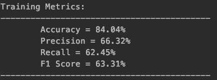

Solution PP6 Group 04 (Bolzano)
================================

Task 01
--------

#### Q1. Which were the 6 classification types used?

- The classification labels we used were:
  -  Anatomical Scans
  -  Biological Cartoons
  -  Chemical Structures
  -  Graphical Representations
  -  Staining/Blotting Tests
  -  Textual information/Representations

Task 02
--------

#### Q1. How does the application work?

- The application can be invoked (once built using maven) using the command,
    ```
    java -jar target/bolzano-0.1.jar
    ```
- The classification can for a single image can be carried out using the tags,
    `--input`
  - The input take the path of an image that needs to be classified.
- For re-training the model `-train` flag can be used with the `-input` path pointing to the folder containing the images to train the model on.
  - During the re-training the labels must be provided as a csv file containing 2 columns, 1st indicating the name of the image and the 2nd indicating the image's label, like shown below
  
- | Image_Name (String) | Label (Integer) |
  |:-------------------:|:---------------:|
  | A.jpg | 1 |
  | B.png | 0 |
  
  *Note - There shouldn't be a header in the actual data*

#### Q2. How to analyze the histogram?
- After converting the image to grayscale, the values of the dataframe are iterated to get 
the pixel values and a new dataframe is created with help of the given pixel value occurrence.
- This is how the histogram gets stored in the application for further analysis.
- Next this histogram undergoes unsupervised machine learning approach, which is logistic regression.
- This ML approach classifies the data in a multinomial fashion.
- For logistic regression, along with our model we used "smile" package.

#### Q3. How to evaluate the application/model?

- The model can be evaluated using scoring metrics such as Accuracy & F1 Score.
- As our data is multinomial (more than 2 classes in for classification) in nature, 
Accuracy and F1 scores are not defined for it, we had to get more creative and convert the 
multinomial case into a One Vs Rest case where we carried out many binary calculation and 
then summed it up and took the average of it.

The best results we achieved were as follows


Task 03
--------

#### Q1. How the API work, along with the format expected?

- The protocol which has been used to transfer the data is HTTP.
- HTTP GET request is used to retrieve the data from the database.
- Spring Boot framework is used to create the REST API.
- The data is retrieved from the SQLite database and JPA concepts were utilized to 
implement the mapping of the image name between the database and the application.